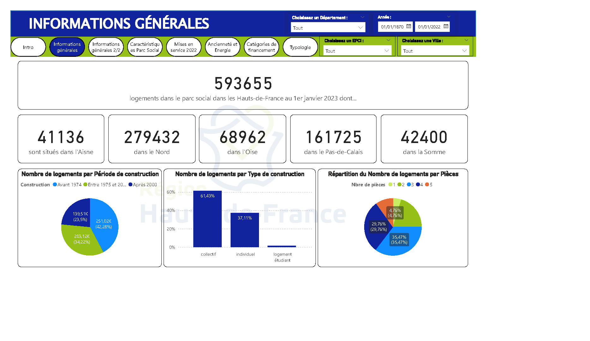
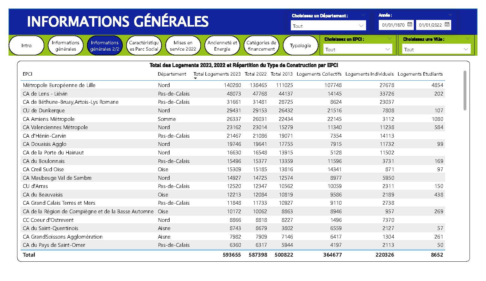
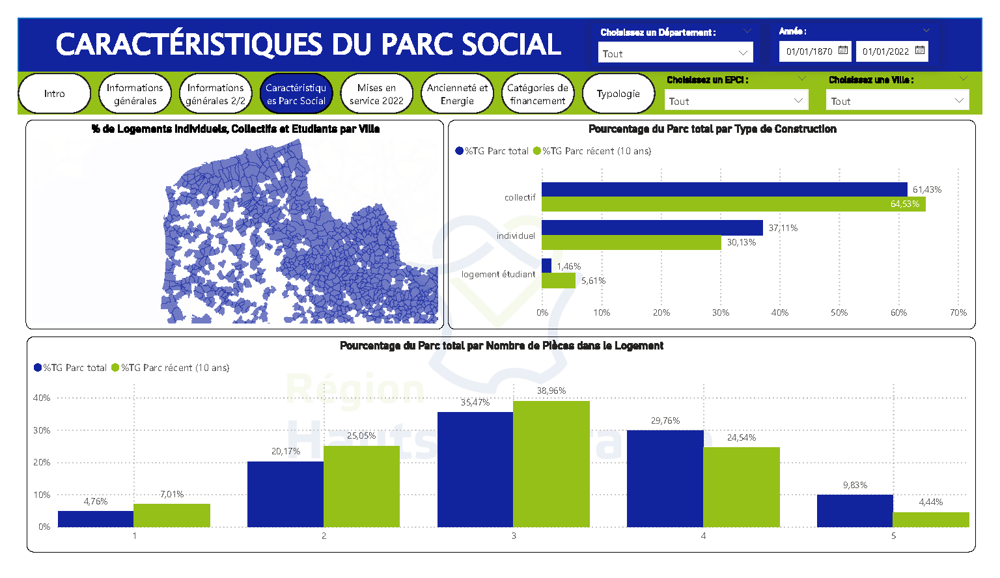
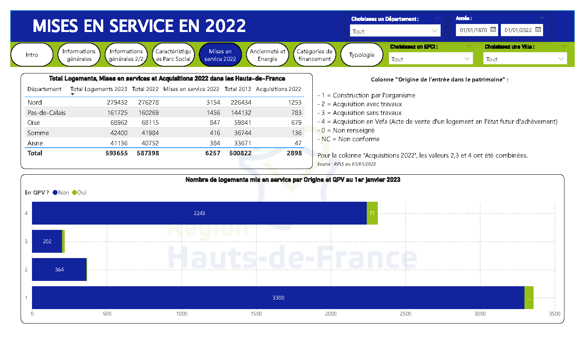
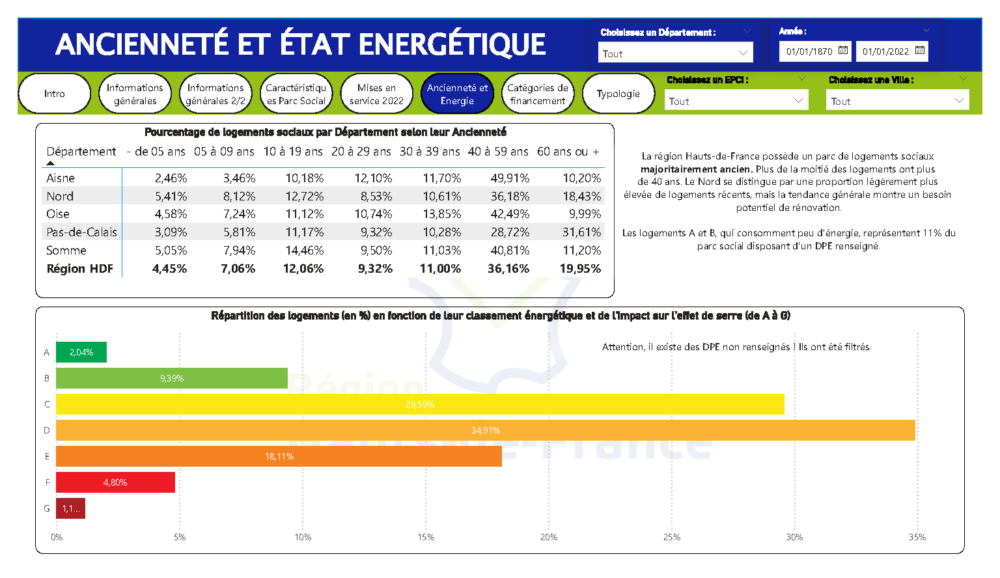
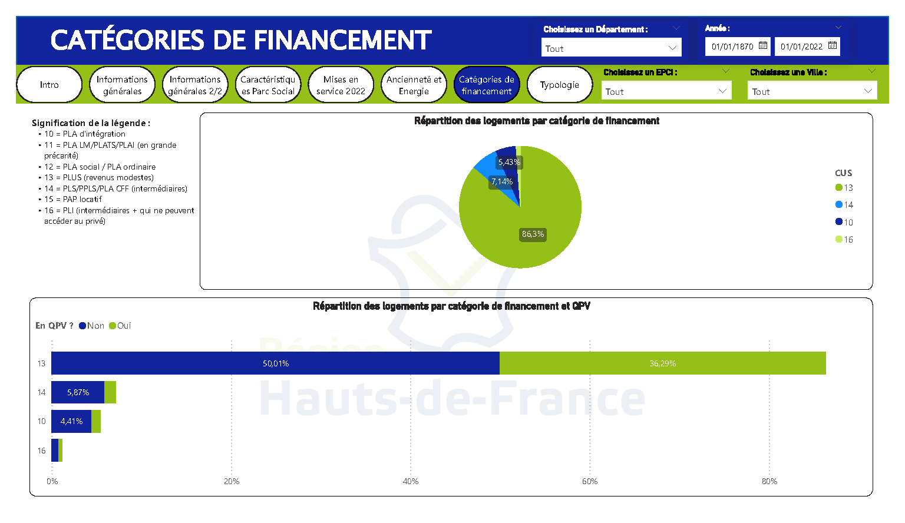

# Analyse des logements sociaux dans les Hauts-de-France au 1er janvier 2023 - Données publiques

*(Réalisée en Août 2024)*

  

## Dataset

Lien vers le Dataset : https://dreal.statistiques.developpement-durable.gouv.fr/parc_social/2023/hauts_de_france/RPLS_2023_32_hauts_de_france_export_donnees_illustrations_2023-12-08.xlsx

## Contenu

Données RPLS (Répertoire des Logements Locatifs des Bailleurs Sociaux) : https://www.statistiques.developpement-durable.gouv.fr/catalogue?page=datafile&datafileRid=f3c2f2cb-8fb1-40fd-8733-964247744c9a (Données publiques)

Liste des colonnes : 

CONV /
NUMCONV /
DATCONV /
NEWLOGT_CODE /
NEWLOGT_LIBELLE /
CUS /
DPEDATE /
DPEENERGIE /
DPESERRE /
SRU_EXPIR /
SRU_ALINEA /
CODSEGPATRIM /
LIBSEGPATRIM /
PMR_CODE /
PMR_LIBELLE /
PLG_VOIE /
EPSG /
X /
Y /
PLG_QP /
PLG_IRIS2022_CODE /
PLG_IRIS2022_LIBELLE /
PLG_ZUS /
PLG_ZFU /
PLG_QVA /
QUALITE_VOIE /
QUALITE_NUMERO /
QUALITE_XY /
DISTANCE_PRECISION /
QUALITE_QP /
QUALITE_IRIS /
QUALITE_ZUS /
QUALITE_ZFU /
QUALITE_QVA /
COMAQP /
COMAZUS /
COMIRIS /
UU2020 /
AAV2020 /
ZE2020 /

## Overview

Le Dashboard ainsi que le Notebook (en version pdf car trop lourd à uploader sur GitHub) est une synthèse de l’état du parc social au 1er janvier 2023 en Hauts-de-France.

Les données sont comparées sur 10 ans, ce qui inclut la période Covid-19 qui a fortement impacté les différents indicateurs présentés dans cette publication.

Les données sont actualisées tous les ans, en fin d'année civile.

# Méthode d'analyse

- Récupération du fichier ;
- Nettoyage : valeurs manquantes, doublons, réparation des caractères spéciaux (accents...) qui apparaissaient mal dans le fichier (encodage UTF-8), ajout/suppression de colonnes, formatage ;
- Identification des premières informations : nombre de lignes/colonnes, moyennes, médianes, valeurs min/max, etc. ;
- Analyse par thématiques ;
- Data visualisation avec Python (Matplotlib, Seaborn), puis réalisation d'un tableau de bord avec Power BI.

## Observations après analyse

📌 Près de 600 000 logements sociaux (593 655 exactement) sont répertoriés dans les Hauts-de-France au 01/01/2023 d'après ce fichier. Affichage du nombre de logements par département. La répartition par département est la suivante, dans l'ordre décroissant :

    Nord : 279 432 logements
    Pas-de-Calais : 161 725 logements
    Oise : 68 962 logements
    Somme : 42 400 logements
    Aisne : 41 136 logements
    
📌 Pour les caractéristiques du parc social, nous avons : 

Par période de construction :

    42,28% des logements ont été construits avant 1974
    34,22% entre 1975 et 2000
    23,5% après 2000

Par type de construction : 

    61,43% des logements sont des logements collectifs (donc quasiment 2/3 des logements)
    37,11% sont des logements individuels

Selon le nombre de pièces : 

    La majorité des logements possèdent 3 pièces (35,47%)
    Les logements avec 2 pièces représentent 29,76%

📌 Pour les mises en service en 2022, nous obtenons un total de 6 257 logements dont la répartition est par département : 

    Nord : 3 154 logements
    Pas-de-Calais : 1 456 logements
    Oise : 847 logements
    La Somme et l'Oise n'ont pas eu de mise en service.

📌 Concernant l'état énergétique et ancienneté des logements, nous constatons :

L'âge des logements est ancien voire très ancien : 60% des logements ont plus de 30 ans, indiquant une prédominance de logements anciens.

Concernant la classe énergétique : 

    Les logements classés A et B (consommation faible) ne représentent que 11% du parc social avec un DPE renseigné.
    La majorité des logements sont classés C ou D.

📌 Pour la typologie des logements, nous apercevons :

Surfaces d'habitation :

    Le parc récent (moins de 10 ans) tend à être composé de logements plus petits, avec une proportion plus élevée de logements de moins de 30 m² et entre 30 et 50 m².
    Les logements de plus grande surface (70 m² et plus) sont moins représentés dans le parc récent.

## Conclusion

📌 Vieillissement du parc : La région Hauts-de-France possède un parc de logements sociaux majoritairement ancien, avec plus de la moitié ayant plus de 30 ans. Cette situation suggère un potentiel besoin de rénovation et de mise à jour pour répondre aux standards actuels, notamment en matière de performances énergétiques.

📌 État énergétique : La prédominance des logements avec des classifications énergétiques C et D indique des efforts à poursuivre pour améliorer l'efficacité énergétique.

📌 Accessibilité PMR (personnes à mobilité réduite) : Malgré une légère amélioration dans le parc récent, il reste un défi important en termes d'accessibilité pour les personnes à mobilité réduite, ainsi qu'un manque de documentation sur ces aspects.

